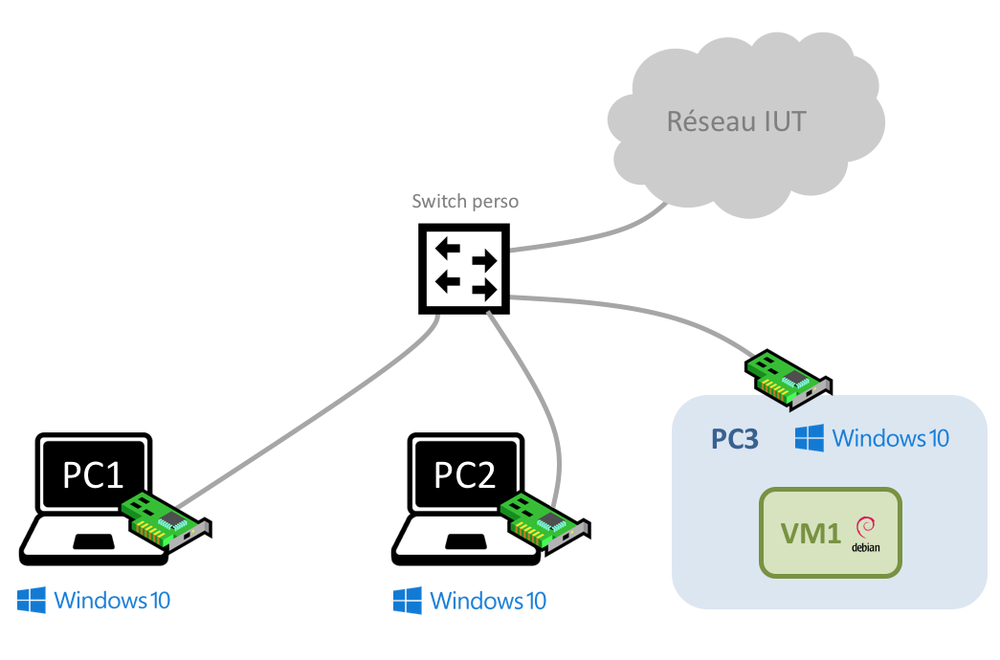
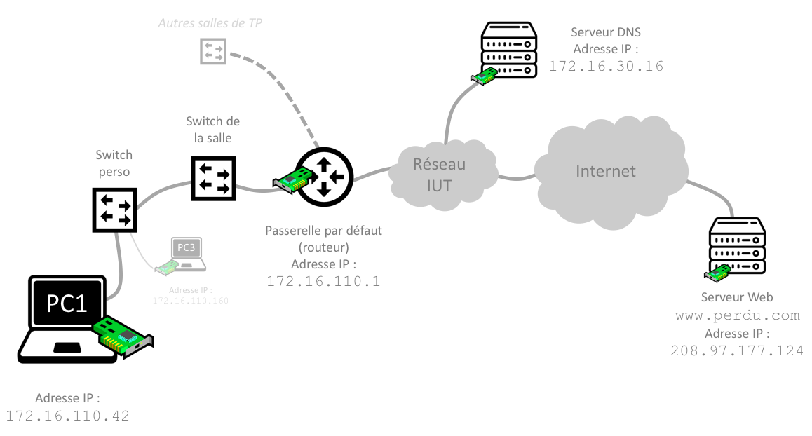
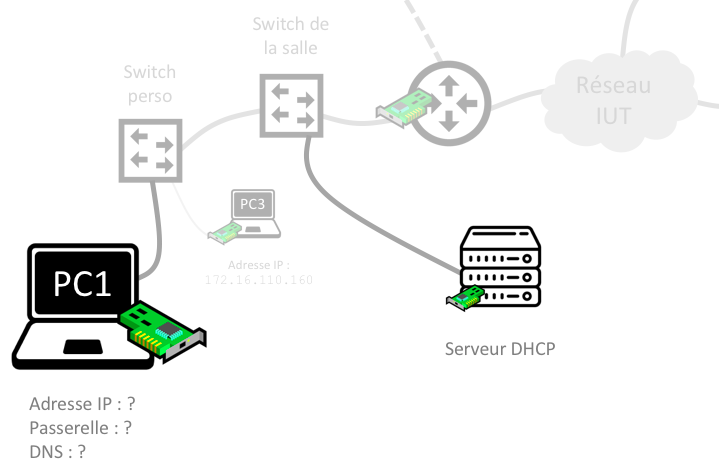
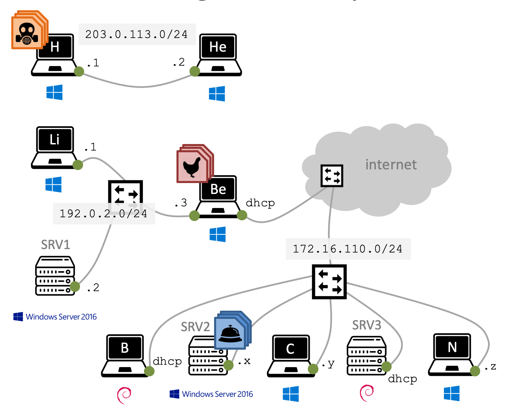

# Découverte du réseau

Ce TP consiste en une introduction à l'administration réseau. Vous découvrirez le rôle des trois [adresses IP](https://fr.wikipedia.org/wiki/Adresse_IP) que tout ordinateur doit connaitre pour accéder à internet : la sienne, bien sûr, mais aussi celle de sa [passerelle par défaut](https://fr.wikipedia.org/wiki/Routeur), et enfin celle de son [serveur DNS](https://fr.wikipedia.org/wiki/Domain_Name_System). Vous apprendrez que ces paramètres peuvent être configurés manuellement ou automatiquement. 
Enfin, vous terminerez avec quelques notions d'administration système sous Windows 10. 

## Préparation de la maquette

La figure suivante illustre la maquette de TP :

- Les trois PC sont branchés sur votre switch perso (``HP`` ou ``3Com``), lui-même relié au réseau de l'IUT
- Vous allez réaliser toutes les manipulations sur les PC de gauche et de droite (PC1 et PC3 sous ``Windows 10``)
- PC3 héberge également une VM sous ``Debian Linux``
- Le PC du milieu (PC2 sous ``Windows 10``) sera utilisé pour afficher le sujet de TP et réaliser le compte-rendu

<p align="center">
	
</p>

Avant toute chose, [lancez la restauration](https://doc2-iutrt.readthedocs.io/en/latest/divers.html#lancer-la-restauration-d-un-os) de ``Windows 10`` sur vos PC.

Pendant la restauration, profitez-en pour câbler votre maquette comme indiqué. Le PC du milieu possède plusieurs cartes réseau. *Vous êtes libres de choisir n'importe laquelle.* 
Pour chaque câble branché sur un port de votre switch, vérifiez *systématiquement* que le voyant d'état correspondant s'allume sur la face avant du switch. *Si ce n'est pas le cas, c'est que vous avez commis une erreur de câblage !*

Démarrez les OS et ouvrez une session sur les trois PC avec les [identifiants de l'IUT](https://doc2-iutrt.readthedocs.io/en/latest/divers.html#identifiants-de-l-iut). 

Enfin, [importez une VM](https://doc2-iutrt.readthedocs.io/en/latest/virtualbox.html#importer-une-vm) ``Debian Stretch`` sur PC3 (*pensez à réinitialiser son adresse MAC*) et configurez-la en [mode ``Accès par pont``](https://doc2-iutrt.readthedocs.io/en/latest/virtualbox.html#configurer-la-carte-reseau-d-une-vm-en-mode-acces-par-pont).

## Préparation

Avant de commencer à configurer votre maquette, répondez aux questions suivantes sur une feuille :

- Comment appelle-t-on la représentation du masque suivant : ``/24`` ?
- Convertissez le masque précédent en notation décimale à point. 
- Calculez l'adresse du réseau auquel appartient l'adresse ``172.16.110.42/24``. 
- Dans un réseau IP, quel est le rôle de la passerelle par défaut ?
- Quel est le rôle d'un serveur DNS ?

Dessinez un schéma de votre maquette en faisant apparaitre :

- Les ordinateurs utilisés (physiques et VM) et le câblage
- L'OS utilisé sur chaque PC et VM

Faites valider votre préparation par votre chargé de TP.


# Check-list pour se connecter à internet

Ouvrez un navigateur Web sur PC1 et PC3 et vérifiez que vous avez accès à internet (affichez la page de ``www.perdu.com``). 

Cela vous semble magique ? Pourtant, ça ne l'est pas : au démarrage, vos PC ont demandé et obtenu *automatiquement* toutes les informations nécessaires pour accéder à internet. 

Ces paramètres sont au nombre de trois :
- L'adresse IP du PC (accompagnée de son masque)
- L'adresse IP de la passerelle par défaut
- L'adresse IP du serveur DNS

Dans cette partie, vous allez inspecter tous les éléments impliqués dans une connexion à internet. Ils sont représentés sur la figure suivante.

<a name="fig-connexion-internet"></a>

<p align="center">
	
</p>

## Adresse IP et masque

[Affichez les cartes réseau](https://doc2-iutrt.readthedocs.io/en/latest/windows.html#afficher-les-cartes-reseau) de PC1 puis [déterminez son adresse IP](https://doc2-iutrt.readthedocs.io/en/latest/windows.html#determiner-l-adresse-ip-de-la-carte-reseau-ethernet-4). Faites de même sur PC3.

Échangez vos résultats avec vos voisins et remplissez le tableau suivant :

PC | Nom de la carte | Adresse IP | Masque
------- | --------| ---------- | -----
``PC Exemple`` | ``Ethernet 4`` | ``198.51.100.42`` | ``255.255.0.0``
``PC1`` |  |  |
``PC3`` |  |  |
``PC1 voisin`` |  |  |
``PC3 voisin`` |  |  |
``PC fantôme`` | Néant | 172.16.110.3 | 255.255.255.0

Depuis PC1, [lancez un ping](https://doc2-iutrt.readthedocs.io/en/latest/windows.html#lancer-un-ping-vers-l-adresse-ip-8-8-8-8) vers PC3, puis vers les PC de vos voisins pour confirmer qu'ils peuvent communiquer ensemble. 
Enfin, [lancez un ping](https://doc2-iutrt.readthedocs.io/en/latest/windows.html#lancer-un-ping-vers-l-adresse-ip-8-8-8-8) vers une adresse IP non attribuée (*PC fantôme*) pour observer un échec de ping. 

## Passerelle par défaut

[Affichez l'adresse de la passerelle par défaut](https://doc2-iutrt.readthedocs.io/en/latest/windows.html#afficher-l-adresse-de-la-passerelle-par-defaut) de PC1 et PC3. Échangez cette information avec vos voisins et [lancez un ping](https://doc2-iutrt.readthedocs.io/en/latest/windows.html#lancer-un-ping-vers-l-adresse-ip-8-8-8-8) vers cette adresse. 

*Notez cette information car vous en aurez besoin plus tard.*

Paramètre | Valeur
----- | -----
Passerelle de PC1 |
Passerelle de PC3 |
Passerelle de PC1 *voisin* |
Passerelle de PC3 *voisin* |

> :information_source: Comment un PC utilise-t-il la passerelle pour communiquer avec l'extérieur ? C'est une des nombreuses questions auxquelles nous répondrons ... plus tard !

## Serveur DNS

[Affichez l'adresse IP du serveur DNS](https://doc2-iutrt.readthedocs.io/en/latest/windows.html#afficher-l-adresse-du-serveur-dns) de vos deux PC et [lancez un ping](https://doc2-iutrt.readthedocs.io/en/latest/windows.html#lancer-un-ping-vers-l-adresse-ip-8-8-8-8) vers cette adresse. 

*Notez cette information car vous en aurez besoin plus tard.*

Paramètre | Valeur
----- | -----
Serveur DNS de PC1 |
Serveur DNS de PC3 |
Serveur DNS de PC1 *voisin* |
Serveur DNS de PC3 *voisin* |

[Résolvez les noms de domaine](https://doc2-iutrt.readthedocs.io/en/latest/windows.html#resoudre-le-nom-de-domaine-www-perdu-com) suivants :

- ``www.perdu.com``
- ``www.google.com``
- ``www.purepeople.com``

Enfin, vérifiez que vous pouvez [lancer un ping](https://doc2-iutrt.readthedocs.io/en/latest/windows.html#lancer-un-ping-vers-l-adresse-ip-8-8-8-8) vers tous ces serveurs. 

## Synthèse 1

<p align="center">
	
</p>

Résumez en 4-6 lignes vos observations sur l'architecture de votre réseau. Appuyez-vous sur les adresses IP que vous venez de noter (architecture logique) ainsi que sur l'[architecture physique](#fig-connexion-internet)).

Appelez votre chargé de TP pour lui montrer la configuration IP de vos PC. Montrez également qu'ils peuvent se pinger.

# Configuration dynamique ou statique

Comment vos PC ont-ils obtenu ces paramètres de configuration (adresse IP, passerelle et DNS) ? Ils les ont tout simplement demandés au serveur [DHCP](https://fr.wikipedia.org/wiki/Dynamic_Host_Configuration_Protocol) de l'IUT, représenté sur la figure suivante.

Le rôle d'un serveur DHCP, lorsqu'il reçoit la requête d'un PC, est de :

- Lui attribuer une adresse IP disponible
- Lui indiquer l'adresse de la passerelle par défaut et du serveur DNS

<a name="fig-connexion-internet"></a>

<p align="center">
	
</p>

A chaque démarrage, vos PC ont en effet pour instruction d'interroger le serveur DHCP de l'IUT : ils ont une configuration IP *dynamique*. [Affichez la configuration de la carte réseau](https://doc2-iutrt.readthedocs.io/en/latest/windows.html#afficher-la-configuration-de-la-carte-ethernet) et vérifiez qu'elle est bien configurée en [adressage dynamique](https://doc2-iutrt.readthedocs.io/en/latest/windows.html#configurer-la-carte-ethernet-4-en-adressage-dynamique-persistant).

Voyons maintenant comment se comportent vos ordinateurs lorsqu'ils sont privés de ces informations. 

## Pas de configuration

Dans cette partie, vous allez *supprimer* la configuration dynamique sur PC1 et PC3, et observer le résultat. 

Sur PC1, commencez par [effacer sa configuration IP](https://doc2-iutrt.readthedocs.io/en/latest/windows.html#effacer-la-configuration-ip), puis essayez de vous connecter à internet et de [lancer un ping](https://doc2-iutrt.readthedocs.io/en/latest/windows.html#lancer-un-ping-vers-l-adresse-ip-8-8-8-8) vers PC3. 
[Affichez les détails de la connexion réseau](https://doc2-iutrt.readthedocs.io/en/latest/windows.html#fig-details-connexion-reseau) pour confirmer que PC1 n'a plus ni adresse IP, ni passerelle par défaut, ni serveur DNS. 

A présent, [effacez la configuration IP](https://doc2-iutrt.readthedocs.io/en/latest/windows.html#effacer-la-configuration-ip) de PC3. 

> :sweat_smile: Vos deux PC se retrouvent maintenant sans aucun accès internet !

## Configuration dynamique

Après avoir médité quelques minutes sur l'utilité d'un PC sans accès internet, configurez de nouveau PC1 en [adressage dynamique persistant](https://doc2-iutrt.readthedocs.io/en/latest/windows.html#configurer-la-carte-ethernet-4-en-adressage-dynamique-persistant) et assurez-vous qu'il peut à nouveau surfer sur la toile. 

*Ne touchez pas à PC3 pour le moment : vous allez découvrir une seconde méthode de configuration dans la partie suivante.*

## Configuration statique

En effet, il est possible d'attribuer *manuellement* une adresse IP à une carte réseau. Dans ce cas, on parle de configuration *statique*, par opposition une configuration *dynamique* obtenue via un serveur DHCP. 

Le but de cette partie est d'obtenir à nouveau un accès à internet sur PC3, mais cette fois en configurant vous-même tous les paramètres. 

Commencez par configurer la carte réseau de PC3 en [adressage statique](https://doc2-iutrt.readthedocs.io/en/latest/windows.html#configurer-la-carte-ethernet-4-en-adressage-statique). Attribuez-lui l'adresse ``172.16.110.$num/24``, ou ``$num`` représente votre numéro de table auquel on a ajouté 10. N'indiquez pas l'adresse de la passerelle ni celle du serveur DNS. *Vous les configurerez dans quelques minutes.*

Vérifiez que vous pouvez dès maintenant [lancer un ping](https://doc2-iutrt.readthedocs.io/en/latest/windows.html#lancer-un-ping-vers-l-adresse-ip-8-8-8-8) vers PC1. 
En revanche, impossible de lancer un ping en dehors de votre réseau IP. Par exemple, lancez un ping vers l'adresse IP ``8.8.8.8``. Vous observez le message d'erreur suivant :

```
	PING : échec de la transmission. Défaillance générale.
```

Pour sortir de votre propre réseau, vous devez à présent [configurer la passerelle par défaut](https://doc2-iutrt.readthedocs.io/en/latest/windows.html#configurer-la-carte-ethernet-4-en-adressage-statique). Bien sûr, il s'agit de la passerelle par défaut de la salle de TP, que vous avez notée un peu plus tôt ...

Connaissant sa passerelle par défaut, PC3 est maintenant capable de lancer un ping en dehors de son réseau IP. Vérifiez-le en lançant un ping vers ``8.8.8.8``.

Par contre, la résolution des noms de domaine ne fonctionne pas encore. Si vous essayez de [résoudre le nom de domaine](https://doc2-iutrt.readthedocs.io/en/latest/windows.html#resoudre-le-nom-de-domaine-www-perdu-com) ``www.perdu.com``, vous observez le message suivant :

```
	*** [...] www.perdu.com : No response from server
```

Il vous reste donc à [configurer le serveur DNS](https://doc2-iutrt.readthedocs.io/en/latest/windows.html#configurer-la-carte-ethernet-4-en-adressage-statique), et vous retrouverez un accès à internet sur PC3. *Rappelez-vous que vous avez noté cette adresse un peu plus tôt ...*

Tentez une [résolution du nom](https://doc2-iutrt.readthedocs.io/en/latest/windows.html#resoudre-le-nom-de-domaine-www-perdu-com) puis connectez-vous à ``www.perdu.com`` avec un navigateur Web. *Si la page suivante s'affiche, c'est gagné !*

<a name="fig-perdu-com"></a>

<p align="center">
	
</p>

> :bulb: L'accès à internet peut donc s'obtenir aussi bien avec une configuration dynamique que statique, à condition que les paramètres IP soient configurés correctement : adresse, passerelle et DNS. 

## Synthèse 2

<p align="center">
	
</p>

Résumez en 4-6 lignes ce que vous avez fait depuis la dernière synthèse. 

Appelez votre chargé de TP pour lui montrer la configuration IP de vos PC. Montrez également qu'ils peuvent se pinger.

# Un nouveau défi

Dans cette partie, vous allez collaborer avec vos voisins installés sur le même 'îlot' que vous (votre table, et celle juste en face). 

## Maquette collaborative

Utilisez toutes vos connaissances en câblage, virtualisation, administration système et administration réseau pour réaliser la maquette suivante. 

<a name="fig-defi-suite"></a>

<p align="center">
	
</p>

Vous devez porter une attention toute particulière aux détails suivants :

- Le câblage
- L'OS, représenté par une icône sous chaque ordinateur
- Le rôle (client ou serveur), indiqué par un pictogramme spécifique
- Le nom de l'utilisateur et de l'ordinateur. Par exemple, l'ordinateur en haut à gauche appartient à l'utilisateur ``H``, et il se nomme ``PC-DE-H``
- L'adressage IP, indiqué à côté de chaque carte réseau. Le mot-clé ``dhcp`` indique un adressage dynamique. Les lettres ``x``, ``y`` et ``z`` représentent votre numéro de table auquel on a ajouté, respectivement 10, 22 et 34. 
- Les dossiers partagés. La gestion de leurs droits d'accès et la création des lecteurs réseau sont laissées à votre discrétion

## Synthèse 3

<p align="center">
	
</p>

Résumez en 4-6 lignes maximum les grandes étapes de réalisation de votre maquette collaborative. 

Appelez votre chargé de TP pour une petite démo de vos compétences techniques. 
