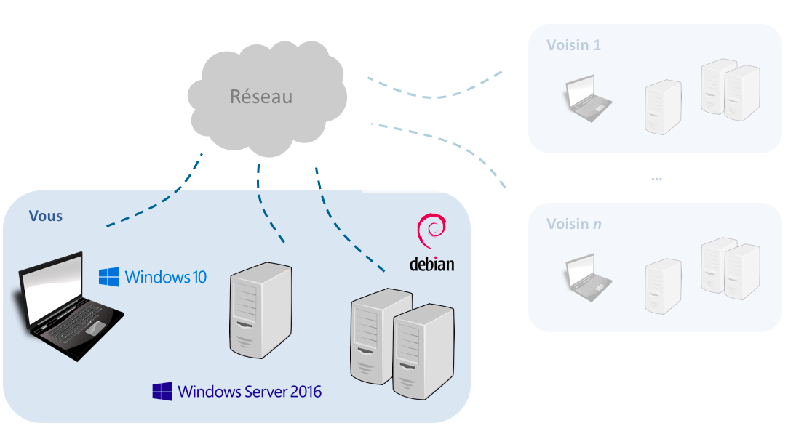
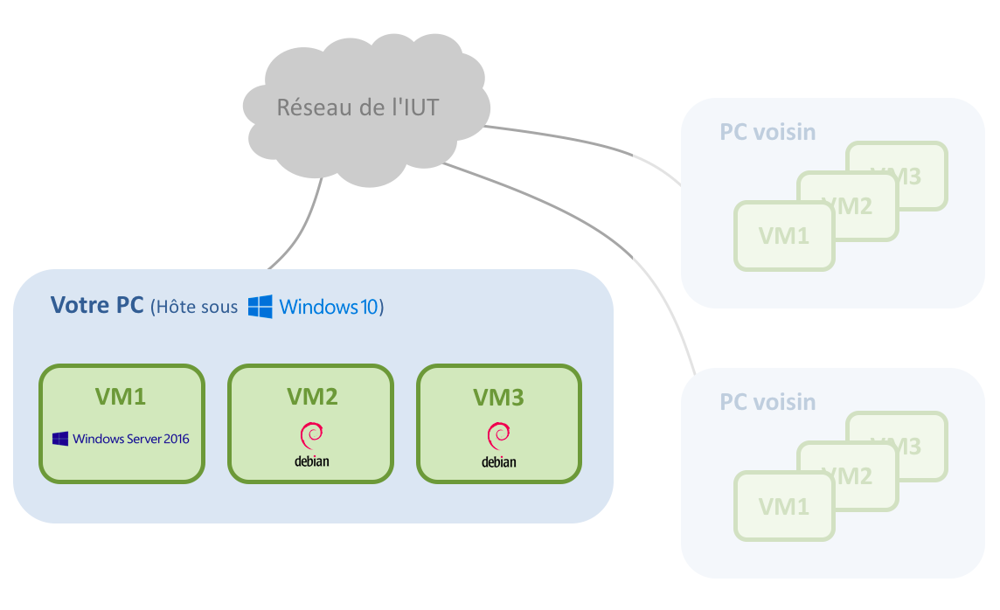
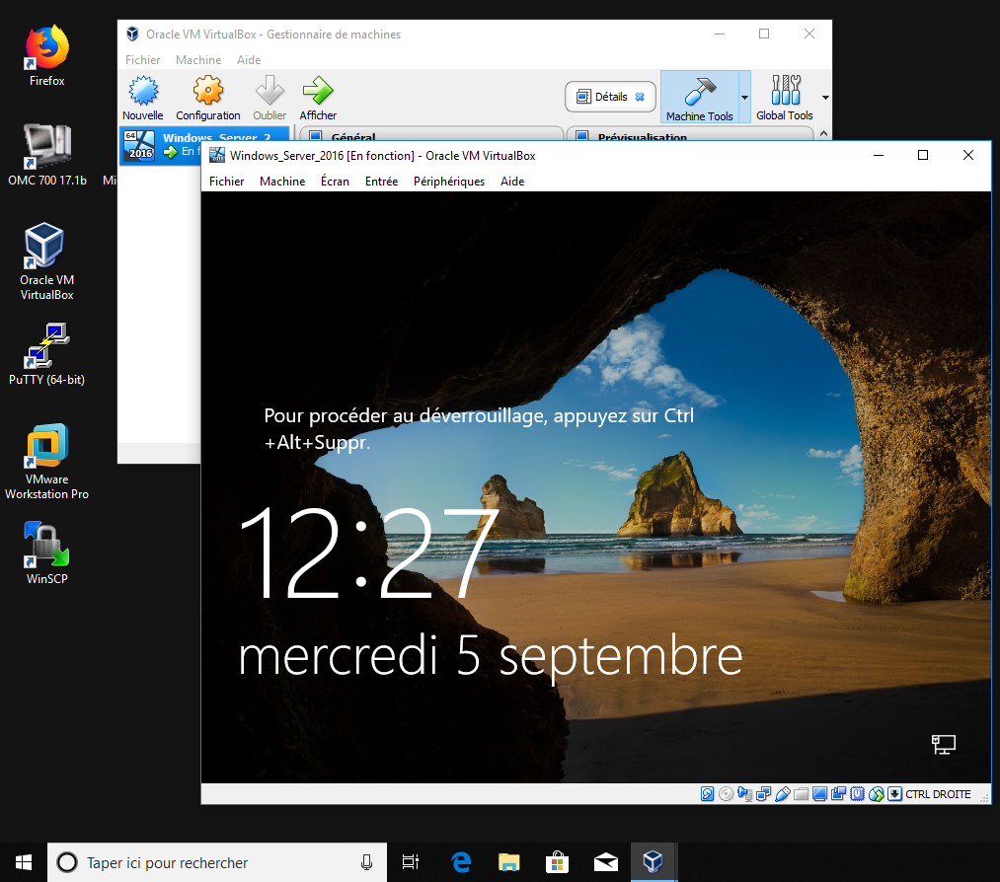
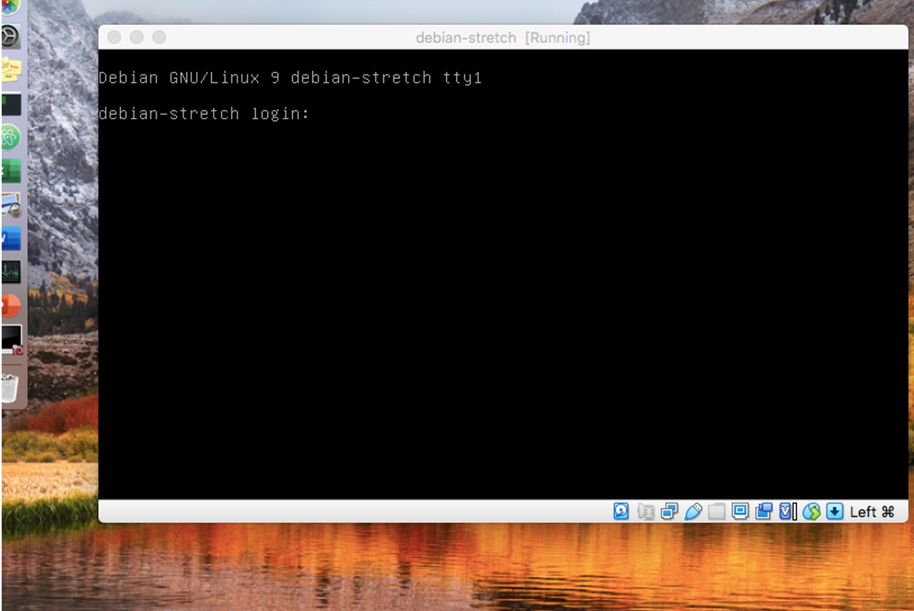
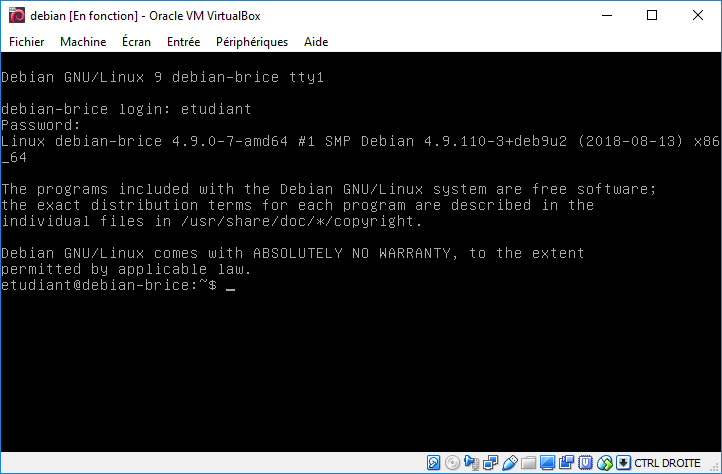
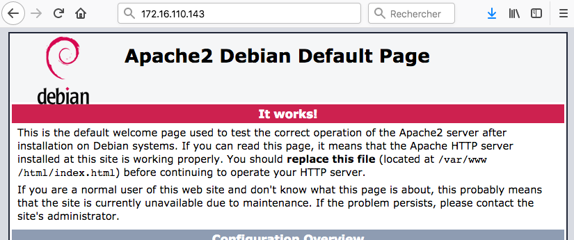
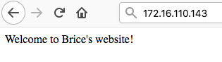
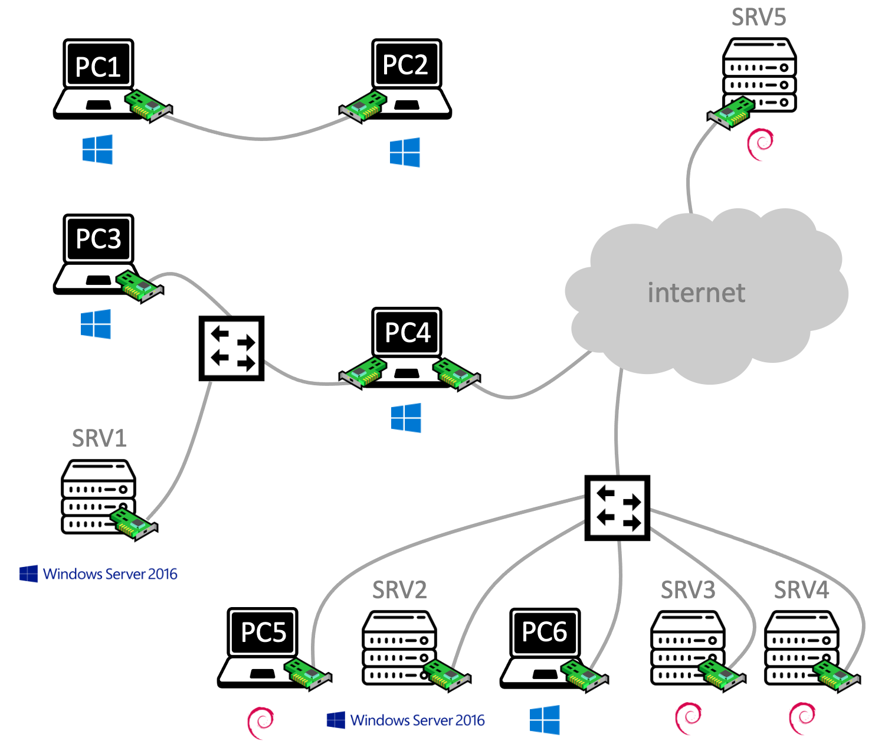

# Découverte de la salle de TP Réseaux

Le but de ce premier TP est de vous familiariser avec le matériel, les logiciels et le système de restauration qui sont à votre disposition dans la salle de TP Réseaux. 

> :warning: Vous ferez appel à ces notions quasiment à chaque TP :
> il est donc indispensable de les assimiler rapidement ! 

## Contexte

Dans ce TP, vous allez réaliser la maquette suivante. Il s'agit de votre premier [réseau local](https://fr.wikipedia.org/wiki/R%C3%A9seau_local) (LAN), composé de quatre ordinateurs avec trois systèmes d'exploitation (OS) différents : ``Windows 10``, ``Windows Server 2016`` et ``Debian Linux``. 

Malgré ces différences, vous verrez que ces ordinateurs ont suffisamment de points communs pour être capables de communiquer ensemble. Cerise sur le gâteau, vous pourrez également communiquer avec les ordinateurs de tous vos collègues dans la salle de TP.

<p align="center">
	
</p>

## Maquette

Vous allez réaliser cette maquette *individuellement* (un étudiant par PC). Néanmoins, la salle de TP ayant un nombre de PC limité, il ne sera pas possible de réaliser une maquette entièrement physique. Pour contourner ce problème, vous allez vous appuyer sur la [virtualisation](https://fr.wikipedia.org/wiki/Virtualisation) : comme l'illustre la figure suivante, une partie des ordinateurs (``Windows Server 2016`` et les deux ``Debian Linux``) seront des [machines virtuelles](https://fr.wikipedia.org/wiki/Machine_virtuelle) (VM).

<p align="center">
	
</p>


Pour réaliser votre maquette, utilisez de préférence un PC d'extrémité. 

> :warning: N'utilisez le PC du milieu que s'il y a trois étudiants par table.

# Environnement de travail

## Restauration

[Lancez la restauration](https://doc2-iutrt.readthedocs.io/en/latest/divers.html#lancer-la-restauration-d-un-os) de ``Windows 10`` sur votre PC. 

Pendant la restauration de votre PC, profitez-en pour câbler votre maquette comme indiqué dans la suite du TP. 

## Câblage

Avec vos collègues, vous allez maintenant créer un *réseau local avec accès à internet*. Cela se résume à une simple opération de [brassage](https://fr.wikipedia.org/wiki/Panneau_de_brassage) : il s'agit de relier physiquement vos PC au réseau de l'IUT, qui lui-même est relié à internet. 

La figure suivante donne un exemple de brassage du PC8 sur le réseau de l'IUT. Vous devez vous en inspirer pour réaliser votre propre brassage, à l'aide des indications suivantes :

- La baie de brassage et le switch de la salle se situent au fond de la salle
- Certaines parties du câblage sont déjà réalisées et fixes (vous ne devez en aucun cas y toucher)
- Un switch est un équipement actif dont vous étudierez le fonctionnement plus tard dans l'année. Pour le moment, sachez simplement que vous pouvez brancher vos câbles Ethernet sur n'importe quel port du switch
- Sur votre baie de brassage perso, utilisez impérativement le switch de marque ``3Com`` ou ``HP``

Après le brassage, attendez que la restauration se termine, démarrez votre PC sous ``Windows 10`` et ouvrez une session avec les [identifiants de l'IUT](https://doc2-iutrt.readthedocs.io/en/latest/divers.html#identifiants-de-l-iut). 

Vérifiez que vous avez accès à internet. Si ce n’est pas le cas, appelez votre chargé de TP. 

## Importation d'une VM

Voyons à présent comment créer un premier ordinateur virtuel sur votre ordinateur physique. 

Prenez quelques minutes pour observer le répertoire des [VM préinstallées](https://doc2-iutrt.readthedocs.io/en/latest/divers.html#vm-preinstallees). 

Lancez l'application ``Oracle VM VirtualBox`` à partir du Bureau ou du menu ``Démarrer``, et [importez une VM](https://doc2-iutrt.readthedocs.io/en/latest/virtualbox.html#importer-une-vm) ``Windows Server 2016``. 

L’importation prend quelques minutes. Profitez-en pour explorer l'[interface graphique](https://doc2-iutrt.readthedocs.io/en/latest/virtualbox.html#interface-graphique) de VirtualBox : le menu principal, les VM disponibles (*pour l'instant, il n'y en a qu'une*) et leurs caractéristiques (quantité de mémoire vive, taille du disque dur, etc). 

Démarrez votre VM. Une nouvelle fenêtre apparaît, dans laquelle vous pouvez observer le démarrage de ``Windows Server 2016``.

<p align="center">
	
</p>

Laissez cette VM de côté pour le moment, *mais ne l'arrêtez pas* : vous l'utiliserez plus tard. 

Utilisez la même méthode pour [importer](https://doc2-iutrt.readthedocs.io/en/latest/virtualbox.html#importer-une-vm) deux VM ``Debian Bookworm``, [changer leur adresse MAC](https://doc2-iutrt.readthedocs.io/en/latest/virtualbox.html#changer-l-adresse-mac-d-une-vm) et les démarrer.

<p align="center">
	
</p>

## Ouverture de session

La manipulation d’un OS virtualisé ressemble fortement à celle d’un OS installé sur un ordinateur physique, à quelques petites différences près. En effet, comme la VM partage le clavier et la souris avec l’hôte, certaines combinaisons de touches causent des conflits (par exemple, ``Ctrl-Alt-Suppr``). 

Par conséquent, pour envoyer le signal ``Ctrl-Alt-Suppr`` à une VM, vous devez en réalité taper la combinaison ``Ctrl-Droite`` et ``Suppr``.
Utilisez cette combinaison de touches pour ouvrir une session sur ``Windows Server 2016`` avec les [identifiants de l'IUT](https://doc2-iutrt.readthedocs.io/en/latest/divers.html#identifiants-de-l-iut).

Vous pouvez fermer le ``Gestionnaire de serveur`` qui s'ouvre automatiquement. Vous n'en aurez pas besoin dans ce TP. 

Ouvrez également une session sur les deux VM Debian, toujours avec les [identifiants de l'IUT](https://doc2-iutrt.readthedocs.io/en/latest/divers.html#identifiants-de-l-iut).

<p align="center">
	
</p>

## Mode réseau

Enfin, vous devez systématiquement configurer les cartes réseau de vos VM en [mode ``Accès par pont``](https://doc2-iutrt.readthedocs.io/en/latest/virtualbox.html#configurer-la-carte-reseau-d-une-vm-en-mode-acces-par-pont). 

> :information_source: Vous étudierez le rôle de ce mode plus tard, dans un module du second semestre. Pour le moment, sachez simplement qu'il permet à la VM de communiquer librement avec tous les autres ordinateurs du réseau. 

Appliquez cette configuration sur la VM ``Windows Server 2016`` et sur les deux ``Debian``, puis [redémarrez-les](https://doc2-iutrt.readthedocs.io/en/latest/linux.html#redemarrer-le-systeme) pour prendre en compte les modifications. 

## Synthèse

<p align="center">
	
</p>

Résumez en 4-6 lignes ce que vous avez fait depuis le début du TP. 

Appelez votre chargé de TP pour lui montrer vos trois VM. 

# Découverte de l'administration système et réseau

Dans cette partie, vous allez vérifier que vos quatre ordinateurs (l'hôte sous ``Windows 10`` et les trois VM) peuvent communiquer ensemble. 

## Adresse IP

Avant d'établir une communication, il faut déjà déterminer l'[adresse IP](https://fr.wikipedia.org/wiki/Adresse_IP) de chaque ordinateur, qu'il soit physique ou virtuel. 

Déterminez l'adresse IP des quatre ordinateurs ([Windows](https://doc2-iutrt.readthedocs.io/en/latest/windows.html#determiner-l-adresse-ip-de-la-carte-reseau-ethernet-4), [Linux](https://doc2-iutrt.readthedocs.io/en/latest/linux.html#determiner-l-adresse-ip)) qui constituent votre réseau. Notez vos résultats dans un tableau :

Nom | Type | Adresse IP
--------------------- | ----| ----------
``PC Exemple`` | Physique | ``172.16.110.42/24``
``Hôte - Windows 10`` | Physique |
``VM1 - Windows Server 2016`` | Virtuel |
``VM2 - Debian Bookworm (#1)`` | Virtuel |
``VM3 - Debian Bookworm (#2)`` | Virtuel |

Vous remarquerez que les quatre adresses IP commencent toutes par ``172.16.110``. Par convention, à l'IUT le troisième nombre (ici ``110``) correspond au numéro de la salle de TP. Le quatrième identifie chaque équipement de manière unique, dans la salle. 

## Ping

Pour vérifier que deux ordinateurs A et B peuvent communiquer, on utilise la méthode du ping. Depuis A, on envoie une requête vers B. Si ce dernier répond, c'est que la communication entre A et B est possible. 

Commencez par [lancer un ping](https://doc2-iutrt.readthedocs.io/en/latest/windows.html#lancer-un-ping-vers-l-adresse-ip-8-8-8-8) de ``Windows Server 2016`` (VM1) vers ``Debian Bookworm`` (VM2), et [inversement](https://doc2-iutrt.readthedocs.io/en/latest/linux.html#lancer-un-ping-vers-l-adresse-ip-8-8-8-8).

Notez le résultat des deux pings dans un tableau :

De | Vers | OK/NOK
--- | --- | ---
``VM1`` | ``VM2`` |
``VM2`` | ``VM1`` |

Vérifiez ensuite que vos quatre ordinateurs (physique et virtuels) peuvent communiquer ensemble.

Enfin, choisissez deux collègues dans la salle et vérifiez que vous pouvez communiquer avec leurs ordinateurs. 

## Serveur Web

Vous allez à présent doter votre maquette d'un premier [service réseau](https://fr.wikipedia.org/wiki/Service_r%C3%A9seau). Il s'agit d'un serveur Web, qui sera hébergé sur la VM2 (``Debian Linux``). Il servira des pages Web qui seront accessibles depuis n'importe quel autre ordinateur de la salle, *y compris ceux de vos collègues*.

Pour transformer un ordinateur Debian en un serveur Web, c'est très simple : il suffit d'[installer le paquetage](https://doc2-iutrt.readthedocs.io/en/latest/linux.html#installer-le-paquetage-apache2-newbie) ``apache2`` !

Testez ce service réseau depuis votre hôte ``Windows 10`` : tapez l'adresse IP de la VM2 dans la barre d'URL d'un navigateur Web (utilisez de préférence ``Firefox``). Si la page suivante s'affiche, *c'est gagné* !

<p align="center">
	
</p>

Personnalisez votre page d'accueil à l'aide de cette incantation magique (*que vous comprendrez mieux dans les semaines à venir*) :

```bash
	echo "Vive le BDE R&T" | sudo tee /var/www/html/index.html
```

Rafraichissez la page pour observer le résultat :

<p align="center">
	
</p>

Vérifiez que le site est également accessible depuis la VM1 (``Windows Server 2016``), *et même depuis les ordinateurs de vos collègues*. 

Prenez quelques minutes pour visiter les sites Web de vos collègues : *peut-être que certains seront plus créatifs que vous concernant le contenu !*

## Synthèse

<p align="center">
	
</p>

Résumez en 4-6 lignes ce que vous avez fait depuis la dernière synthèse. 

Appelez votre chargé de TP pour lui montrer que vous pouvez :
- Communiquer avec tous vos ordinateurs et même avec ceux de vos voisins
- Visiter votre site Web ... et ceux de vos voisins

# Un petit défi

Dans cette partie, vous allez collaborer avec vos voisins installés sur le même 'îlot' que vous (votre table, et celle juste en face). 

## Maquette collaborative

Utilisez toutes vos connaissances en câblage, virtualisation et administration système pour réaliser la maquette suivante. 

<p align="center">
	
</p>

Vous devez porter une attention toute particulière aux détails suivants :

- Le câblage
- L'OS, représenté par une icône sous chaque ordinateur
- Le rôle (client ou serveur), indiqué par un pictogramme spécifique. De plus, chacun des trois serveurs sous ``Debian Linux`` doit héberger un site Web différent, avec le contenu de votre choix. 

Après avoir réalisé la maquette, relevez l'adresse IP de chaque ordinateur dans un tableau comme celui-ci :

Nom | OS | Type | Adresse IP
------ | --- | ----| ----------
``PC1`` | ``Windows 10`` | Physique | ``172.16.110.42/24``
``PC2`` | ``Windows 10`` | Physique |
``SRV1`` | ``Windows Server 2016`` | Virtuel |
``...`` | ...| ... |

Enfin, réalisez quelques tests de ping pour découvrir les ordinateurs qui peuvent communiquer ensemble, et ceux qui sont isolés. Lorsque la destination est un serveur Web, testez également l'accès au site Web qu'il héberge. 

De | Vers | Ping ? | Web ?
--- | --- | --- | ---
``Exemple1`` | ``Exemple2`` | NOK | -
``PC6`` | ``SRV2`` | |
``PC6`` | ``SRV3`` | |
``PC6`` | ``SRV5`` | |
``PC1`` | ``PC2`` | |
``PC1`` | ``SRV3`` | |
``PC4`` | ``SRV1`` | |
``PC4`` | ``SRV5`` | |
``PC3`` | ``SRV3`` | |

## Quelques améliorations

Dans la maquette, PC5 est une VM sous ``Debian Linux`` avec une [interface en ligne de commande](https://fr.wikipedia.org/wiki/Interface_en_ligne_de_commande) (CLI). Pour qu'il puisse jouer pleinement son rôle de client, vous allez la doter d'une [interface graphique](https://fr.wikipedia.org/wiki/Interface_graphique) (GUI). 

Pour cela, il suffit d'[installer les paquetages](https://doc2-iutrt.readthedocs.io/en/latest/linux.html#installer-le-paquetage-apache2-newbie) ``xorg`` et ``awesome``, puis de démarrer l’interface graphique à l'aide la commande :

```
startx
```

Et enfin, configurer le clavier en français :

```
setxkbmap fr
```

## Synthèse

<p align="center">
	
</p>

Résumez en 4-6 lignes ce que vous avez fait depuis la dernière synthèse. 

Appelez votre chargé de TP pour lui montrer le résultat de vos pings et l'accès à vos sites Web. Expliquez-lui également :

- Pourquoi certains ordinateurs n'ont pas d'adresse IP commençant par ``172.16.110``
- Pourquoi certains ordinateurs ne peuvent pas communiquer avec les autres, et n'ont pas d'accès à internet

# Avant de quitter la salle

> :warning: Avant de quitter la salle de TP, vous devez systématiquement ranger votre table. 

Cela implique de :

- Déposer votre CR sur ``Eprel``, au format ``PDF``
- [Lancer la restauration](https://doc2-iutrt.readthedocs.io/en/latest/divers.html#lancer-la-restauration-d-un-os) de tous vos PC
- Débrancher tous les câbles (*n'oubliez pas la baie de la salle*), les enrouler avec soin et les ranger dans le bac
