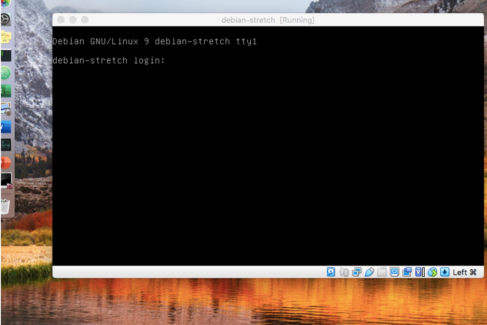

# Environnement de travail

## Restauration

[Lancez la restauration](https://doc2-iutrt.readthedocs.io/en/latest/divers.html#lancer-la-restauration-d-un-os) de ``Windows 10`` sur votre PC. 

Pendant la restauration de votre PC, profitez-en pour câbler votre maquette comme indiqué dans la suite du TP. 

## Câblage

Avec vos collègues, vous allez maintenant créer un *réseau local avec accès à internet*. Cela se résume à une simple opération de [brassage](https://fr.wikipedia.org/wiki/Panneau_de_brassage) : il s'agit de relier physiquement vos PC au réseau de l'IUT, qui lui-même est relié à internet. 

La figure suivante donne un exemple de brassage du PC8 sur le réseau de l'IUT. Vous devez vous en inspirer pour réaliser votre propre brassage, à l'aide des indications suivantes :

- La baie de brassage et le switch de la salle se situent au fond de la salle
- Certaines parties du câblage sont déjà réalisées et fixes (vous ne devez en aucun cas y toucher)
- Un switch est un équipement actif dont vous étudierez le fonctionnement plus tard dans l'année. Pour le moment, sachez simplement que vous pouvez brancher vos câbles Ethernet sur n'importe quel port du switch
- Sur votre baie de brassage perso, utilisez impérativement le switch de marque ``3Com`` ou ``HP``

Après le brassage, attendez que la restauration se termine, démarrez votre PC sous ``Windows 10`` et ouvrez une session avec les [identifiants de l'IUT](https://doc2-iutrt.readthedocs.io/en/latest/divers.html#identifiants-de-l-iut). 

Vérifiez que vous avez accès à internet. Si ce n’est pas le cas, appelez votre chargé de TP. 

## Importation d'une VM

Voyons à présent comment créer un premier ordinateur virtuel sur votre ordinateur physique. 

Prenez quelques minutes pour observer le répertoire des [VM préinstallées](https://doc2-iutrt.readthedocs.io/en/latest/divers.html#vm-preinstallees). 

Lancez l'application ``Oracle VM VirtualBox`` à partir du Bureau ou du menu ``Démarrer``, et [importez une VM](https://doc2-iutrt.readthedocs.io/en/latest/virtualbox.html#importer-une-vm) ``Windows Server 2016``. 

L’importation prend quelques minutes. Profitez-en pour explorer l'[interface graphique](https://doc2-iutrt.readthedocs.io/en/latest/virtualbox.html#interface-graphique) de VirtualBox : le menu principal, les VM disponibles (*pour l'instant, il n'y en a qu'une*) et leurs caractéristiques (quantité de mémoire vive, taille du disque dur, etc). 

Démarrez votre VM. Une nouvelle fenêtre apparaît, dans laquelle vous pouvez observer le démarrage de ``Windows Server 2016``.

	

Laissez cette VM de côté pour le moment, *mais ne l'arrêtez pas* : vous l'utiliserez plus tard. 

Utilisez la même méthode pour [importer](https://doc2-iutrt.readthedocs.io/en/latest/virtualbox.html#importer-une-vm) deux VM ``Debian Stretch``, [changer leur adresse MAC](https://doc2-iutrt.readthedocs.io/en/latest/virtualbox.html#changer-l-adresse-mac-d-une-vm) et les démarrer.

	

