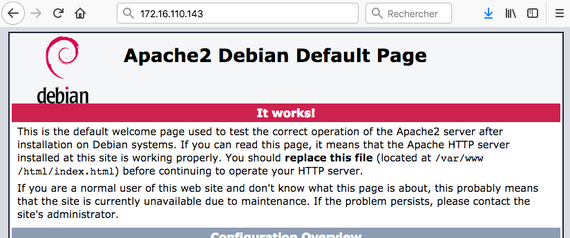

# Découverte de l'administration système et réseau

Dans cette partie, vous allez vérifier que vos quatre ordinateurs (l'hôte sous ``Windows 10`` et les trois VM) peuvent communiquer ensemble. 

## Adresse IP

Avant d'établir une communication, il faut déjà déterminer l'[adresse IP](https://fr.wikipedia.org/wiki/Adresse_IP) de chaque ordinateur, qu'il soit physique ou virtuel. 

Déterminez l'adresse IP des quatre ordinateurs ([Windows](https://doc2-iutrt.readthedocs.io/en/latest/windows.html#determiner-l-adresse-ip-de-la-carte-reseau-ethernet-4), [Linux](https://doc2-iutrt.readthedocs.io/en/latest/linux.html#determiner-l-adresse-ip)) qui constituent votre réseau. Notez vos résultats dans un tableau :

Nom | Type | Adresse IP
--------------------- | ----| ----------
``PC Exemple`` | Physique | ``172.16.110.42/24``
``Hôte - Windows 10`` | Physique |
``VM1 - Windows Server 2016`` | Virtuel |
``VM2 - Debian Stretch (#1)`` | Virtuel |
``VM3 - Debian Stretch (#2)`` | Virtuel |

Vous remarquerez que les quatre adresses IP commencent toutes par ``172.16.110``. Par convention, à l'IUT le troisième nombre (ici ``110``) correspond au numéro de la salle de TP. Le quatrième identifie chaque équipement de manière unique, dans la salle. 

## Ping

Pour vérifier que deux ordinateurs A et B peuvent communiquer, on utilise la méthode du ping. Depuis A, on envoie une requête vers B. Si ce dernier répond, c'est que la communication entre A et B est possible. 

Commencez par [lancer un ping](https://doc2-iutrt.readthedocs.io/en/latest/windows.html#lancer-un-ping-vers-l-adresse-ip-8-8-8-8) de ``Windows Server 2016`` (VM1) vers ``Debian Stretch`` (VM2), et [inversement](https://doc2-iutrt.readthedocs.io/en/latest/linux.html#lancer-un-ping-vers-l-adresse-ip-8-8-8-8).

Notez le résultat des deux pings dans un tableau :

De | Vers | OK/NOK
--- | --- | ---
``VM1`` | ``VM2`` |
``VM2`` | ``VM1`` |

Vérifiez ensuite que vos quatre ordinateurs (physique et virtuels) peuvent communiquer ensemble.

Enfin, choisissez deux collègues dans la salle et vérifiez que vous pouvez communiquer avec leurs ordinateurs. 

## Serveur Web

Vous allez à présent doter votre maquette d'un premier [service réseau](https://fr.wikipedia.org/wiki/Service_r%C3%A9seau). Il s'agit d'un serveur Web, qui sera hébergé sur la VM2 (``Debian Linux``). Il servira des pages Web qui seront accessibles depuis n'importe quel autre ordinateur de la salle, *y compris ceux de vos collègues*.

Pour transformer un ordinateur Debian en un serveur Web, c'est très simple : il suffit d'[installer le paquetage](https://doc2-iutrt.readthedocs.io/en/latest/linux.html#installer-le-paquetage-apache2-newbie) ``apache2`` !

Testez ce service réseau depuis votre hôte ``Windows 10`` : tapez l'adresse IP de la VM2 dans la barre d'URL d'un navigateur Web (utilisez de préférence ``Firefox``). Si la page suivante s'affiche, *c'est gagné* !

<p align="center">
	
</p>

Personnalisez votre page d'accueil à l'aide de cette incantation magique (*que vous comprendrez mieux dans les semaines à venir*) :

```bash
	echo "Vive le BDE R&T" | sudo tee /var/www/html/index.html
```

Rafraichissez la page pour observer le résultat :

<p align="center">
	
</p>

Vérifiez que le site est également accessible depuis la VM1 (``Windows Server 2016``), *et même depuis les ordinateurs de vos collègues*. 

Prenez quelques minutes pour visiter les sites Web de vos collègues : *peut-être que certains seront plus créatifs que vous concernant le contenu !*

## Synthèse

<p align="center">
	
</p>

Résumez en 4-6 lignes ce que vous avez fait depuis la dernière synthèse. 

Appelez votre chargé de TP pour lui montrer que vous pouvez :
- Communiquer avec tous vos ordinateurs et même avec ceux de vos voisins
- Visiter votre site Web ... et ceux de vos voisins
