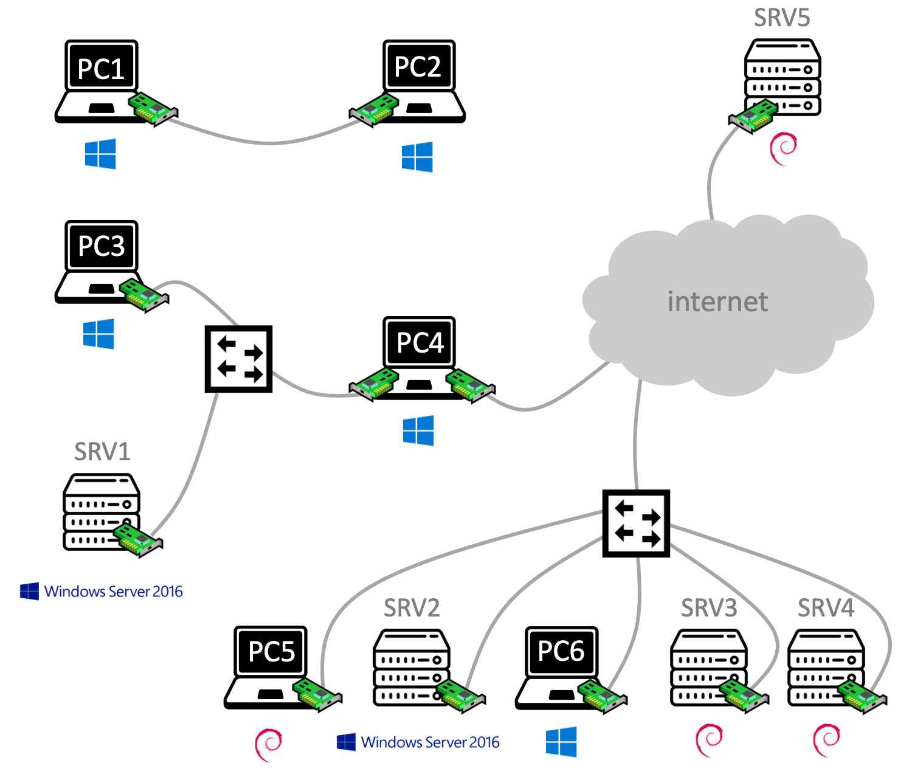

# Un petit défi

Dans cette partie, vous allez collaborer avec vos voisins installés sur le même 'îlot' que vous (votre table, et celle juste en face). 

## Maquette collaborative

Utilisez toutes vos connaissances en câblage, virtualisation et administration système pour réaliser la maquette suivante. 

<p align="center">
	
</p>

Vous devez porter une attention toute particulière aux détails suivants :

- Le câblage
- L'OS, représenté par une icône sous chaque ordinateur
- Le rôle (client ou serveur), indiqué par un pictogramme spécifique. De plus, chacun des trois serveurs sous ``Debian Linux`` doit héberger un site Web différent, avec le contenu de votre choix. 

Après avoir réalisé la maquette, relevez l'adresse IP de chaque ordinateur dans un tableau comme celui-ci :

Nom | OS | Type | Adresse IP
------ | --- | ----| ----------
``PC1`` | ``Windows 10`` | Physique | ``172.16.110.42/24``
``PC2`` | ``Windows 10`` | Physique |
``SRV1`` | ``Windows Server 2016`` | Virtuel |
``...`` | ...| ... |

Enfin, réalisez quelques tests de ping pour découvrir les ordinateurs qui peuvent communiquer ensemble, et ceux qui sont isolés. Lorsque la destination est un serveur Web, testez également l'accès au site Web qu'il héberge. 

De | Vers | Ping ? | Web ?
--- | --- | --- | ---
``Exemple1`` | ``Exemple2`` | NOK | -
``PC6`` | ``SRV2`` | |
``PC6`` | ``SRV3`` | |
``PC6`` | ``SRV5`` | |
``PC1`` | ``PC2`` | |
``PC1`` | ``SRV3`` | |
``PC4`` | ``SRV1`` | |
``PC4`` | ``SRV5`` | |
``PC3`` | ``SRV3`` | |

## Quelques améliorations

Dans la maquette, PC5 est une VM sous ``Debian Linux`` avec une [interface en ligne de commande](https://fr.wikipedia.org/wiki/Interface_en_ligne_de_commande) (CLI). Pour qu'il puisse jouer pleinement son rôle de client, vous allez la doter d'une [interface graphique](https://fr.wikipedia.org/wiki/Interface_graphique) (GUI). 

Pour cela, il suffit d'[installer les paquetages](https://doc2-iutrt.readthedocs.io/en/latest/linux.html#installer-le-paquetage-apache2-newbie) ``xorg`` et ``awesome``, puis de démarrer l’interface graphique à l'aide la commande :

```
startx
```

Et enfin, configurer le clavier en français :

```
setxkbmap fr
```

## Synthèse

<p align="center">
	
</p>

Résumez en 4-6 lignes ce que vous avez fait depuis la dernière synthèse. 

Appelez votre chargé de TP pour lui montrer le résultat de vos pings et l'accès à vos sites Web. Expliquez-lui également :

- Pourquoi certains ordinateurs n'ont pas d'adresse IP commençant par ``172.16.110``
- Pourquoi certains ordinateurs ne peuvent pas communiquer avec les autres, et n'ont pas d'accès à internet

[Terminé](last.md)