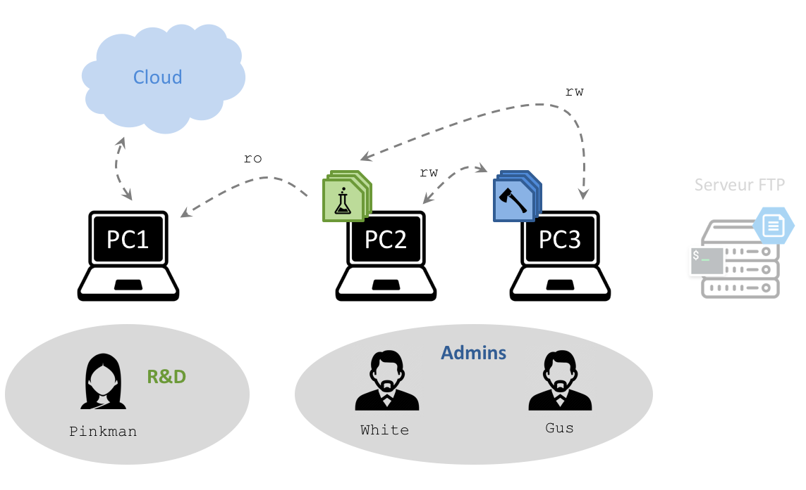
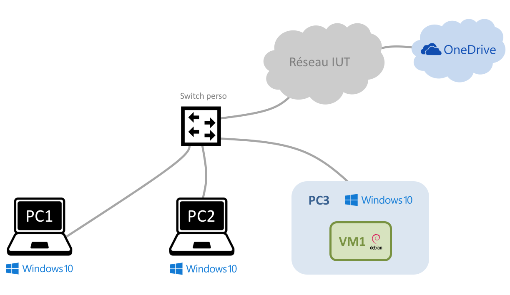
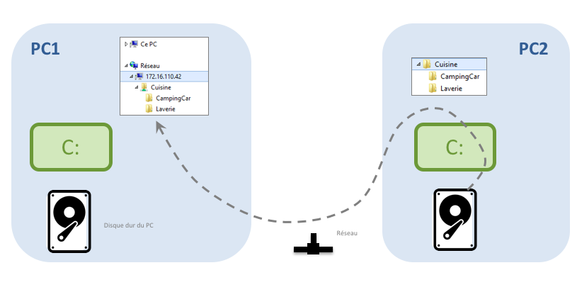
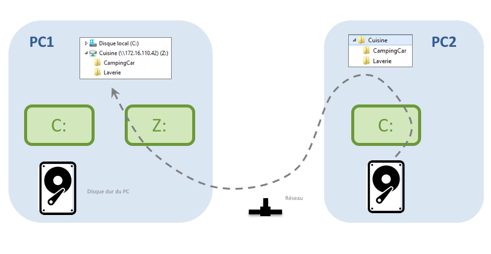

# Découverte de Windows 10

L'objectif de ce TP est d'apprendre à gérer un PC sous ``Windows 10`` : vérifier l'accès à internet, administrer les utilisateurs et gérer les partages de fichiers. S'il vous reste du temps, vous découvrirez les rudiments du langage ``PowerShell``. 

> :warning: A partir de cette séance de TP, vous allez travailler en binôme. Vous ne rendrez qu’un CR par table. Il doit être déposé sur Eprel au format PDF. Il est impératif de déposer votre CR à l’heure, c’est à dire avant la fin du TP.

## Contexte

Vous êtes chargé concevoir le [système d'information](https://fr.wikipedia.org/wiki/Syst%C3%A8me_d%27information) (SI) d'une petite entreprise constituée de trois employés. 

Ces utilisateurs travaillent chacun sur leur PC :

- ``Pinkman`` appartient à l'équipe de ``R&D``. Il utilise ``PC1``. 
- ``White`` et ``Gus`` font partie de l'équipe des ``Admins``. Ils travaillent sur ``PC2`` et ``PC3``, respectivement. 

	

Dans le cadre de leur travail, ils ont régulièrement besoin d'échanger des fichiers. Plutôt que de les laisser galérer avec des clés USB, vous décidez de leur mettre à disposition :

- Des dossiers partagés en réseau, sur leur PC
- Un serveur de fichiers (FTP)
- Un stockage dans le *cloud*

## Maquette

La figure suivante illustre la maquette de TP :

- Les trois PC, sous ``Windows 10``, jouent le rôle des ordinateurs des trois employés de l'entreprise
- ``PC3`` héberge également une VM ``Debian`` qui joue le rôle du serveur FTP

	

[Lancez la restauration](https://doc2-iutrt.readthedocs.io/en/latest/divers.html#lancer-la-restauration-d-un-os) de ``Windows 10`` sur tous les PC. [Importez une VM](https://doc2-iutrt.readthedocs.io/en/latest/virtualbox.html#importer-une-vm) ``Debian Stretch`` sur ``PC3`` et configurez-la en [mode ``Accès par pont``](https://doc2-iutrt.readthedocs.io/en/latest/virtualbox.html#configurer-la-carte-reseau-d-une-vm-en-mode-acces-par-pont). 

Enfin, ouvrez une session sur les trois PC et la VM, avec les [identifiants de l'IUT](https://doc2-iutrt.readthedocs.io/en/latest/divers.html#identifiants-de-l-iut).

## Préparation

Sur une feuille A4, dessinez un schéma de votre maquette en faisant apparaitre :
- Les PC et les VM
- Le câblage interconnectant ces ordinateurs
- L'OS utilisé sur chaque PC et VM

# Configuration IP et système

Ouvrez un navigateur Web sur les trois PC et vérifiez que vous avez accès à internet. 

[Affichez les cartes réseau disponibles](https://doc2-iutrt.readthedocs.io/en/latest/windows.html#afficher-les-cartes-reseau) sur les trois PC et déterminez le nom de la carte utilisée. Soyez particulièrement attentifs à PC2, qui possède *plusieurs cartes réseau*. 

Déterminez l'adresse IP des quatre ordinateurs ([Windows](https://doc2-iutrt.readthedocs.io/en/latest/windows.html#determiner-l-adresse-ip-de-la-carte-reseau-ethernet-4), [Linux](https://doc2-iutrt.readthedocs.io/en/latest/linux.html#determiner-l-adresse-ip)) et vérifiez qu'ils peuvent communiquer ensemble. 

Notez vos résultats dans un tableau :

PC | Nom de la carte | Adresse IP
--------------------- | ----| ----------
``PC Exemple`` | ``Ethernet 4`` | ``198.51.100.42/16``
``PC1`` |  |
``PC2`` |  |
``PC3`` |  |
``VM1`` |  |

Enfin, [renommez](https://doc2-iutrt.readthedocs.io/en/latest/windows.html#renommer-un-pc) vos trois ordinateurs conformément au [cahier des charges](#fig-contexte). 

# Partage de fichiers

Revenons à nos trois employés (Voir [Contexte](#contexte)). 
Supposons que ces utilisateurs aient besoin de s'échanger des fichiers régulièrement, en respectant une politique de confidentialité très stricte : chaque fichier doit être accessible à certains, mais pas à d'autres. 

Cette politique de confidentialité impose les règles suivantes : ``Pinkman`` doit avoir accès à certains fichiers de ``White`` sans pouvoir les modifier, tandis que ``White`` peut modifier librement certains fichiers de ``Gus``. 

Dans ce cas, une solution simple consiste à mettre en place un ensemble de dossiers partagés en réseau. 

## Notion de dossier partagé

Vous décidez d'organiser vos dossiers partagés de la façon suivante :

- Le dossier ``Cuisine`` (sur ``PC2``, en vert sur la figure) sera accessible en lecture seule (``ro``) par ``Pinkman`` et en lecture-écriture (``rw``) par ``Gus``
- Le dossier ``Mexique`` (sur ``PC3``, en bleu) sera accessible en lecture-écriture (``rw``) par ``White``

Pour comprendre le fonctionnement d'un dossier partagé, intéressons-nous au partage du dossier ``Cuisine``. Comme l'illustre la figure suivante, ce partage va permettre à ``Pinkman`` (depuis ``PC1``) d'accéder à *une partie* (et non pas la totalité) des fichiers de ``White`` sur ``PC2``. 

	

Voyons maintenant comment configurer cela. Dans un premier temps, vous allez configurer le dossier ``Cuisine``. Vous vous occuperez du dossier ``Mexique`` un peu plus tard.

## Activation du partage de fichiers

Par défaut, le partage de fichiers est *désactivé* sur tous les postes de travail. 

Vous devez donc activer cette fonctionnalité sur PC1 et PC2 :

- [Changer le profil réseau](https://doc2-iutrt.readthedocs.io/en/latest/windows.html#changer-le-profil-reseau-de-la-connexion) en ``Réseau privé``
- [Autoriser le partage de fichiers](https://doc2-iutrt.readthedocs.io/en/latest/windows.html#autoriser-le-partage-de-fichiers)

## Création des utilisateurs

Dans un second temps, [créez les utilisateurs](https://doc2-iutrt.readthedocs.io/en/latest/windows.html#creer-un-utilisateur) suivants sur PC1 et PC2 :

Utilisateur | A créer sur :
----------- | -------------- 
``Pinkman`` | ``PC1``
``White`` | ``PC2``

[Fermez la session](https://doc2-iutrt.readthedocs.io/en/latest/windows.html#fermer-la-session) ``etudiant`` sur PC1 et ouvrez une session avec votre utilisateur ``Pinkman``. 

Faites de même sur PC2 : ouvrez une session avec l'utilisateur ``White``. 

## Création d'un dossier partagé

A présent, créez un dossier ``C:\Cuisine`` sur PC2. Dans ce dossier, créez quelques dossiers et fichiers texte contenant quelques lignes. 

Ensuite, [partagez ce dossier](https://doc2-iutrt.readthedocs.io/en/latest/windows.html#partager-le-dossier-c-films-present-sur-pc2) sur le réseau. Le dossier est à présent accessible depuis les autres PC du réseau ... *à condition d'avoir les bonnes autorisations !*

Sur PC1, essayez d'[afficher ce dossier](https://doc2-iutrt.readthedocs.io/en/latest/windows.html#afficher-un-dossier-partage) partagé. Il vous sera demandé d'entrer vos identifiants de connexion : entrez ceux de ``Pinkman``. Néanmoins, l'accès est refusé. 

Pour comprendre la raison de ce refus, [inspectez les droits des utilisateurs](https://doc2-iutrt.readthedocs.io/en/latest/windows.html#inspecter-les-droits-d-un-dossier-partage) sur le dossier ``Cuisine`` de PC2. Vous allez remarquer que l'utilisateur ``Pinkman`` n'a aucun droit sur ce dossier partagé, et pour cause ... *cet utilisateur n'existe même pas sur PC2 !*

Vous devez donc [créer cet utilisateur](https://doc2-iutrt.readthedocs.io/en/latest/windows.html#creer-un-utilisateur) sur PC2, puis [configurer les autorisations d'accès](https://doc2-iutrt.readthedocs.io/en/latest/windows.html#configurer-les-autorisations-d-acces-a-un-dossier-partage) sur le dossier partagé. *Accordez seulement le droit de lecture*, comme indiqué sur la [figure](#fig-contexte). 

Sur PC1, réaffichez ensuite le dossier partagé, et vérifiez que, cette fois, vous pouvez afficher le contenu des fichiers qu'il contient. 

## Synthèse 1

	

Résumez en 4-6 lignes ce que vous avez fait depuis le début de la séance. 

Appelez votre chargé de TP pour lui montrer votre maquette. Expliquez-lui également le principe d'un dossier partagé.  

## Autres dossiers partagés

Complétez votre maquette en accord avec la [figure](#fig-contexte) : le dossier partagé ``Mexique`` doit être hébergé sur le PC de ``Gus`` et son contenu peut être affiché (et modifié !) par ``White``. De plus, ``Gus`` doit avoir accès en lecture-écriture au dossier ``Cuisine``.

> :icecream: veillez aux autorisations de ``White`` sur le dossier ``Mexique`` ...

Quand vous aurez terminé la configuration, réalisez les tests suivants pour vous assurer que le cahier des charges est bien respecté :

Test | Succès ?
----------- | -------------- 
``Pinkman`` affiche ``Cuisine`` | Oui
``Pinkman`` modifie ``Cuisine`` |
``Pinkman`` affiche ``Mexique`` |
``White`` affiche ``Mexique`` |
``White`` modifie ``Mexique`` |
``Gus`` affiche ``Cuisine`` |
``Gus`` modifie ``Cuisine`` |

## Lecteur réseau

On souhaite maintenant faciliter le travail de ``Pinkman`` en créant un *lecteur réseau* sur son PC. 
Un lecteur réseau est un disque *virtuel* qui apparait aux côtés des disques durs locaux (par exemple, ``C:``) dans l'``Explorateur Windows``. Mais ce disque a une particularité, illustrée par la figure suivante : il est lié à un *dossier partagé en réseau*. 
En d'autres termes, quand ``Pinkman`` affichera le contenu de ce lecteur (ici ``Z:``), il affichera le contenu du dossier ``Cuisine`` qui se trouve sur un autre ordinateur. 

	

Sur PC1, ouvrez une session avec ``Pinkman``. [Créez un lecteur réseau](https://doc2-iutrt.readthedocs.io/en/latest/windows.html#creer-un-lecteur-reseau-l) utilisant la lettre ``Z`` et lié au dossier ``Cuisine`` de PC2. 

Vérifiez que ce nouveau lecteur (``Z``) est apparu dans l’``Explorateur Windows`` de ``Pinkman`` sur PC1, et que ce lecteur est bien lié au dossier partagé de PC2 : en explorant ce lecteur, le contenu du dossier ``Cuisine`` doit apparaitre, comme dans la figure précédente. 

[Fermez votre session](https://doc2-iutrt.readthedocs.io/en/latest/windows.html#fermer-la-session) puis rouvrez-la, et vérifiez que le lecteur est toujours présent. 

Terminez votre configuration des partages réseau en créant, sur le PC de ``White``, un lecteur (``G``) lié au dossier ``Mexique`` de PC3. 

## Stockage cloud

Enfin, vous allez mettre à disposition de ``Pinkman`` un second espace de stockage réseau. Comme indiqué dans le [contexte](#fig-contexte), il s'agit d'un espace de stockage dans le *cloud* de ``Microsoft``, nommé ``OneDrive``. 

Sur PC1, ouvrez une session en tant que ``Pinkman`` (si ce n'est pas déjà le cas) et [connectez-vous à votre compte ``OneDrive``](https://doc2-iutrt.readthedocs.io/en/latest/windows.html#se-connecter-a-un-compte-onedrive). 

*L'inconvénient majeur du stockage cloud est qu'il ne fonctionne plus sans connexion à internet ...*

> :warning: A la fin du TP, n'oubliez pas de vous [déconnecter de OneDrive](https://doc2-iutrt.readthedocs.io/en/latest/windows.html#se-deconnecter-de-onedrive) pour empêcher quiconque d’accéder à vos fichiers depuis ce PC. 

## Synthèse 2

	

Résumez en 4-6 lignes ce que vous avez fait depuis la dernière synthèse. 

Appelez votre chargé de TP pour lui montrer que :

- ``Pinkman`` peut lire les fichiers dans ``Cuisine``, mais pas dans ``Mexique`` et qu'il dispose d'un stockage cloud
- ``White`` peut écrire dans ``Mexique``
- ``Gus`` peut écrire dans ``Cuisine``

# Un peu d'administration système

## Raccourcis clavier

A la longue, vous constaterez que la souris est souvent peu efficace pour réaliser certaines tâches répétitives. Au contraire, il existe de nombreux raccourcis clavier pour réaliser la plupart des actions habituelles : [gestion de texte et de fichiers](https://doc2-iutrt.readthedocs.io/en/latest/windows.html#raccourcis-clavier-de-gestion-des-objets-texte-et-fichiers), [gestion des fenêtres](https://doc2-iutrt.readthedocs.io/en/latest/windows.html#raccourcis-clavier-de-gestion-des-fenetres). 

Vous avez aussi la possibilité de créer vos [raccourcis personnels](https://doc2-iutrt.readthedocs.io/en/latest/windows.html#creer-un-raccourci-personnel-pour-lancer-firefox) pour lancer une application.

Sans utiliser la souris une seule fois, vérifiez que vous pouvez :

- Ouvrir le ``bloc-note`` et agrandir la fenêtre sur le côté gauche de l'écran
- Y écrire le message ``Bonjour``,
- Dupliquer 20 fois ce texte, puis 
- Sauvegarder le texte dans un fichier nommé ``bonjour.txt`` dans le dossier ``Documents``
- Fermer le ``bloc-note``
- Supprimer définitivement le fichier

## Contrôle à distance

Depuis PC1, [connectez-vous en SSH](https://doc2-iutrt.readthedocs.io/en/latest/linux.html#se-connecter-en-ssh-sur-le-pc-203-0-113-10-avec-le-compte-otabenga) sur la VM1 et installez un serveur Web dessus, avec une page Web personnalisée. 

Vérifiez que vous pouvez afficher cette page Web depuis n'importe quel PC de votre réseau. 

## Synthèse 3

	

Résumez en 4-6 lignes ce que vous avez fait depuis la dernière synthèse. 

Appelez votre chargé de TP pour lui montrer que vous pouvez :

- Vous passer de la souris
- Administrer un PC ``Linux`` depuis un PC ``Windows``
- Créer un petit site Web et naviguer dessus
