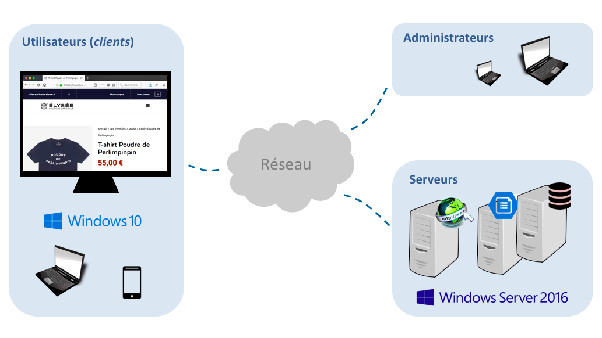
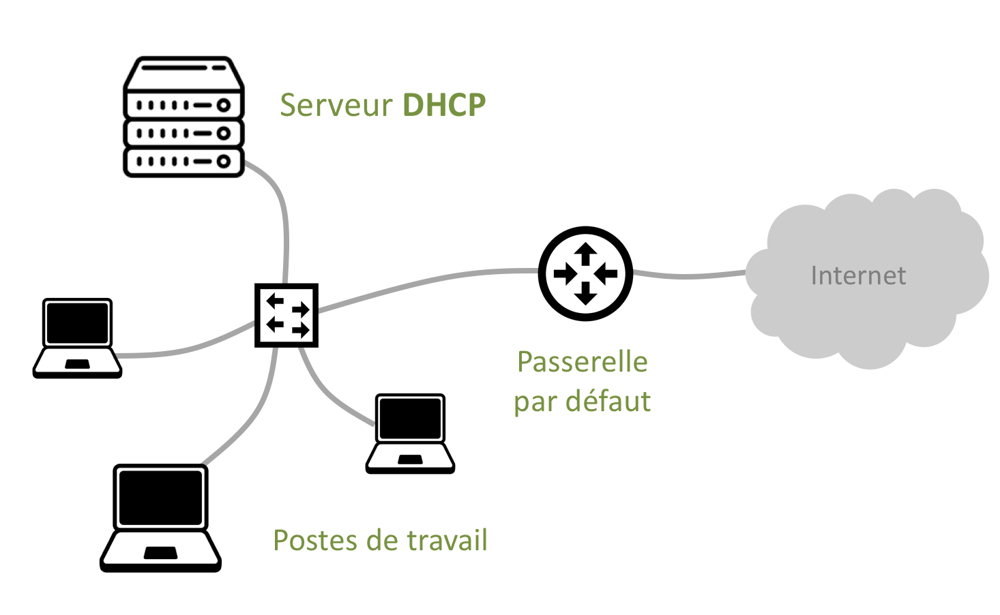
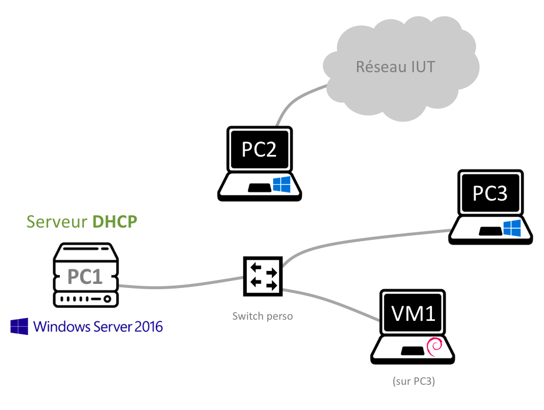

# Découverte de Windows Server

Jusqu’à présent, vous avez surtout été des utilisateurs d'internet (donc, du côté *client*), en surfant sur le Web avec ``Mozilla Firefox`` ou ``Microsoft Edge``, en téléchargeant des fichiers, ou encore en consultant vos emails. 

*Mais vous êtes-vous déjà demandé ce qui se trouve 'de l'autre côté' du réseau, côté serveur ?*

La figure suivante résume l'architecture 'classique' d'un réseau. Cette architecture est basée sur le [modèle client - serveur](https://fr.wikipedia.org/wiki/Client-serveur) : les *clients* (utilisateurs finaux du grand public, employés d'entreprise, etc.) utilisent leurs appareils (PC, smartphone, tablette, etc.) pour accéder à des services (Web, stockage, messagerie, etc.) hébergés par des *serveurs*. Cette infrastructure est mise en place, surveillée et maintenue par des *administrateurs*. 

	

Parmi ces services réseau, vous connaissez certainement :

- Le Web, pour la diffusion de pages Web
- Le FTP pour le téléchargement de fichiers
- La messagerie électronique

Dans ce TP, vous allez découvrir un premier service réseau offert par ``Windows Server 2016`` : l'attribution dynamique d'adresses IP via un serveur ``DHCP``. 

> :information_source: Il existe bien d'autres types de services réseau, que vous découvrirez plus tard dans l'année. 

## Contexte

Il est temps de découvrir la version *Serveur* de l'OS Windows : ``Windows Server 2016``. Cet OS est basé sur ``Windows 10``, auquel il apporte de nouvelles fonctionnalités spécifiques aux services réseau. 

L'objectif de ce TP est de créer votre propre LAN privé, qui respecte les contraintes suivantes :

- L'adressage IP doit être *dynamique* et utiliser le réseau ``203.0.113.0/24``
- Les ordinateurs du LAN doivent avoir accès à internet

	

La première contrainte (fournir des adresses IP dynamiques) implique de configurer *votre propre serveur DHCP*.

La seconde contrainte (fournir un accès à internet) va vous obliger à configurer *votre propre passerelle par défaut*. 

## Maquette

La figure suivante illustre la maquette de TP, constituée de quatre ordinateurs (les trois PC et une VM) :

- PC1, sous ``Windows Server 2016``, joue le rôle de serveur DHCP
- PC3, sous ``Windows 10``, joue le rôle d'un poste de travail
- VM1, sous ``Debian Linux``, est hébergée sur PC3 et joue le rôle d'un second poste de travail

> :pencil2: Notez bien que ces trois ordinateurs étant reliés par le switch de votre table, ils forment un réseau local (LAN) qui est totalement isolé du réseau de l'IUT. 

- PC2 (sous ``Windows 10``) est le seul ordinateur à être relié au réseau de l'IUT. 
Pour le moment, vous allez l'utiliser pour visualiser le sujet de TP et rédiger votre CR. *Vous le transformerez en passerelle par défaut dans la seconde partie du TP.* 

	

[Lancez la restauration](https://doc2-iutrt.readthedocs.io/en/latest/divers.html#lancer-la-restauration-d-un-os) de ``Windows 10`` sur tous les PC. [Importez la VM](https://doc2-iutrt.readthedocs.io/en/latest/virtualbox.html#importer-une-vm) comme indiqué sur la figure et configurez-la en [mode ``Accès par pont``](https://doc2-iutrt.readthedocs.io/en/latest/virtualbox.html#configurer-la-carte-reseau-d-une-vm-en-mode-acces-par-pont). 

Ouvrez une session sur les quatre ordinateurs, avec les [identifiants de l'IUT](https://doc2-iutrt.readthedocs.io/en/latest/divers.html#identifiants-de-l-iut). 

# Préparation de la maquette

Vérifiez que tous les ordinateurs sont configurés en [adressage dynamique](https://doc2-iutrt.readthedocs.io/en/latest/windows.html#configurer-la-carte-ethernet-4-en-adressage-dynamique-persistant), y compris PC1 sous Windows Server. Affichez leur configuration IP* et relevez leur adresse IP. 